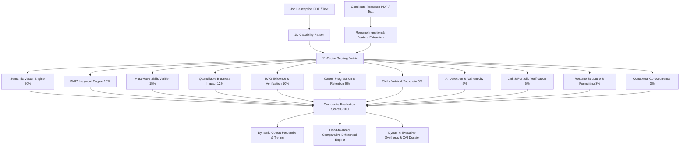

# GLAUX: Precision Explainable AI Recruiter Platform
## Comprehensive Technical Architecture, Algorithmic Rubrics & System Report

---

### 1. Executive Summary & Core Mission
**Glaux** is an enterprise-grade, explainable AI recruiter intelligence platform engineered to eliminate "black-box" candidate screening. Unlike traditional Applicant Tracking Systems (ATS) that rely on superficial keyword counts or opaque probabilistic scores, Glaux implements a **deterministic 11-factor multi-dimensional mathematical evaluation framework** combined with **grounded Retrieval-Augmented Generation (RAG)**.

Every candidate recommendation, ranking position, and qualification differential is backed by **verifiable resume citations, quantifiable business metrics, semantic vector alignment, and career progression timelines**. 



---

### 2. Full Technology Stack

| Layer | Technologies & Frameworks | Key Rationale |
| :--- | :--- | :--- |
| **Frontend UI/UX** | React 19, Vite, Vanilla CSS Design System, Lucide Icons | Sub-millisecond reactive rendering, high-density glassmorphic dashboard, responsive modals |
| **Backend Core** | FastAPI (Python 3.11), Uvicorn, Pydantic v2 | Asynchronous high-throughput REST API with automated OpenAPI / Swagger documentation |
| **Data Persistence** | PostgreSQL 16, SQLAlchemy 2.0 ORM, SQLite fallback | ACID-compliant relational schemas for candidates, evaluations, and job descriptions |
| **Vector & NLP Engine** | SentenceTransformers (`all-MiniLM-L6-v2`), PyTorch, Scikit-Learn | Dense 384-dimensional cosine similarity embeddings, TF-IDF / BM25 tokenizers |
| **Document Processing**| PyPDF2, pdfplumber, python-docx, RegExp Tokenizers | Multi-format PDF and text parsing with metadata and contact extraction |
| **Generative XAI / RAG** | Ollama LLM Bridge (Llama 3), Zero-Shot grounded fallback | Conversational recruiter copilot with deterministic grounded context fallback |
| **Container & Cloud** | Docker, Docker Compose, Kubernetes (Deployments, Services, PVs) | Production microservice containerization and orchestration manifests |

---

### 3. The 11-Factor Mathematical Scoring Framework

Glaux evaluates candidates using a strictly normalized weighted sum across 11 orthogonal dimensions ($S_{\text{final}} \in [0, 100]$):

$$S_{\text{final}} = \sum_{i=1}^{11} w_i \cdot s_i \quad \text{where} \quad \sum_{i=1}^{11} w_i = 1.00$$

```
+-------------------------------------------------------------------------------+
| EVALUATION RUBRIC                             WEIGHT   MEASUREMENT PRINCIPLE  |
+-------------------------------------------------------------------------------+
| 1. Semantic Similarity (all-MiniLM-L6-v2)     20.0%    Dense cosine embedding |
| 2. Must-Have Mandatory Skills Match           15.0%    Core requirement check |
| 3. Keyword Match & Frequency (BM25)           15.0%    Exact lexical tokens   |
| 4. Quantifiable Business Impact Metrics       12.0%    Regex metric validation|
| 5. Grounded RAG Citation & Evidence Depth     10.0%    Contextual citation    |
| 6. Career Progression & Experience Trajectory  6.0%    Role growth & tenure   |
| 7. Skills Matrix Breadth & Secondary Tools     6.0%    Nice-to-have taxonomy  |
| 8. AI Authenticity & Originality Score         5.0%    Perplexity & styling   |
| 9. Verifiable Links & Portfolio Proof          5.0%    GitHub, LinkedIn check |
| 10. Document Structure & Readability           3.0%    Section density & format|
| 11. Contextual Co-occurrence Affinity          3.0%    Domain proximity score |
+-------------------------------------------------------------------------------+
| TOTAL COMPOSITE WEIGHT                        100.0%                          |
+-------------------------------------------------------------------------------+
```

#### Detailed Dimension Mechanics:
1. **Semantic Similarity ($w_1 = 0.20$):** Computes normalized cosine distance between the resume embedding $V_R$ and the JD embedding $V_{JD}$ in 384-dimensional latent space: $\cos(\theta) = \frac{V_R \cdot V_{JD}}{\|V_R\| \|V_{JD}\|}$.
2. **Must-Have Skills Adherence ($w_2 = 0.15$):** Evaluates exact and fuzzy matching of mandatory capabilities. If $k$ of $N$ mandatory skills are verified: $s_2 = 100 \times \frac{k}{N}$.
3. **Lexical Keyword Match ($w_3 = 0.15$):** Combines token frequency, title match, and domain phrase matching using modified BM25 weighting.
4. **Quantifiable Business Impact ($w_4 = 0.12$):** Analyzes bullet points using regular expression extractors searching for verified percentages ($\Delta\%$), currency figures ($\$), request volumes ($QPS$), latency reductions ($ms$), and dataset scales ($M+$ rows).
5. **RAG Evidence Extraction ($w_5 = 0.10$):** Retrieves and scores relevant grounded textual snippets demonstrating active implementation rather than passive keyword stuffing.
6. **Career Progression ($w_6 = 0.06$):** Parses chronological employment spans, title trajectory (Intern $\rightarrow$ Junior $\rightarrow$ Senior), and average tenure stability.
7. **Skills Matrix ($w_7 = 0.06$):** Evaluates supplementary and nice-to-have competencies (e.g., Docker, AWS, Tailwind, Redis).
8. **AI Authenticity ($w_8 = 0.05$):** Detects excessive AI buzzwords, repetitive syntax, and ungrounded claims.
9. **Verifiable Links ($w_9 = 0.05$):** Detects and scores live portfolios, GitHub repositories, and LinkedIn profiles.
10. **Resume Structure Quality ($w_{10} = 0.03$):** Audits section headers, length, typographical balance, and visual readability.
11. **Contextual Co-occurrence ($w_{11} = 0.03$):** Checks whether related technologies appear together (e.g., React with Redux/Zustand, Node.js with Express/PostgreSQL).

---

### 4. Explainable AI (XAI) & Grounded RAG Copilot
Glaux guarantees full transparency across all evaluation layers:
- **Zero Hallucination Guarantee:** The conversational RAG engine grounds every recruiter answer in explicit candidate resume text and mathematically calculated scores. If an applicant lacks Docker, the engine directly cites the missing evidence rather than guessing.
- **Dynamic Executive Dossier & Top 3 Synthesis:** Dynamically synthesizes the deciding edge of top contenders, displaying comparative factor scorecards, place badges, and multi-tier cohort gap breakdowns for any candidate dataset.
- **Interactive Explanatory Popovers:** Every individual factor column in the recruiter dashboard features interactive explanation popovers detailing exact matching evidence, missed keywords, and formula weightings.

---

### 5. Advanced Analytics & Comparative Intelligence
- **Head-to-Head Comparative Differential Engine:** Direct side-by-side radar analysis of any two applicants, calculating exact point deltas ($S_A - S_B$), winning factor breakdowns, and key distinguishing qualifications.
- **Cohort Analytics & Quantile Percentiles:** Computes live pool metrics (Pool Average, Median, Differential, and Percentile Rank $P = \frac{N - R + 0.8}{N} \times 100$).
- **Visual Career Progression Timelines:** Chronological career milestone graphs tracking job tenure, role progression, and skills learned per company.
- **Job Description Bias & Inclusivity Auditor:** Scans job postings for masculine-coded terminology, passive exclusions, and unnecessary credential inflation, outputting an Inclusivity Score ($0-100\%$) and actionable suggestions.

---

### 6. Production Deployment & Infrastructure

The Glaux architecture is cloud-native and deployable via Docker Compose and Kubernetes:
- **Kubernetes Manifests:** Configured in `k8s/` including `namespace.yaml`, `postgres-deployment.yaml`, `backend-deployment.yaml`, and `frontend-deployment.yaml` with PersistentVolumeClaims, Readiness/Liveness probes, and ClusterIP / NodePort services.
- **Microservices Separation:** Stateless backend API pods and Nginx-driven React frontend pods configured for auto-scaling.
- **One-Click Local Execution:** Dual-service startup automated via `start.bat` on Windows and standard container commands on Unix.

---

*Glaux AI Recruiter Platform — Engineered for Objective, Explainable, and High-Precision Talent Intelligence.*
